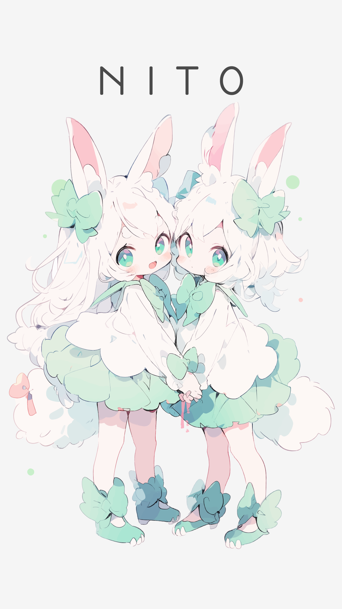
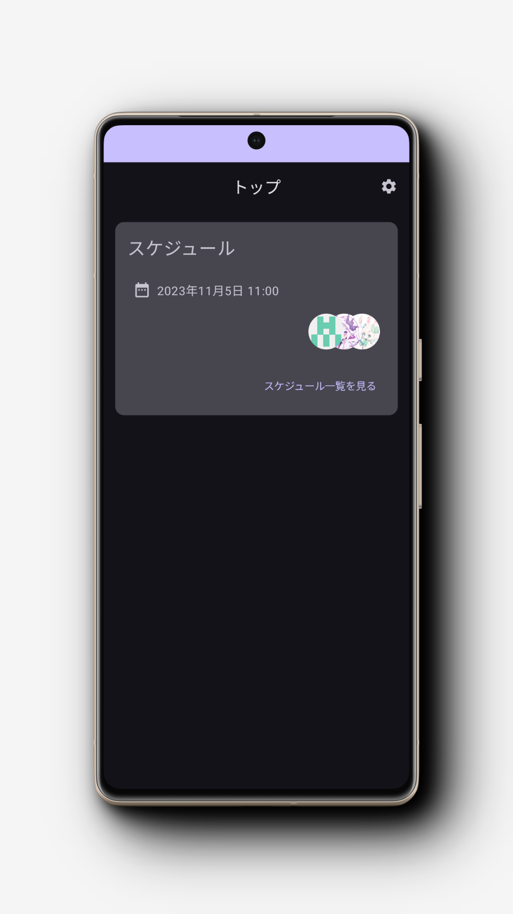
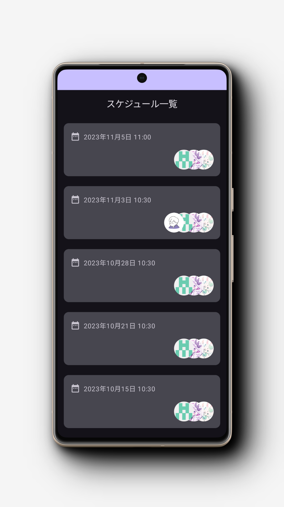

# NITO

NITO のユーザーアプリです。

<a href='https://play.google.com/store/apps/details?id=club.nito.app&pcampaignid=pcampaignidMKT-Other-global-all-co-prtnr-py-PartBadge-Mar2515-1'></a>

## Screenshots



## ディレクトリ構成

```text
.
│   アプリケーションのディレクトリ
├── app
│
│   ビルドロジックを集約したディレクトリ
├── build-logic
│
│   各 feature モジュールで使用する共通のモジュールを集約したディレクトリ
├── core
│
│   各機能モジュールのディレクトリ
└── feature
```

## アーキテクチャ構成

- [Kotlin Multiplatform](https://kotlinlang.org/lp/multiplatform/)
- [Jetpack Compose](https://developer.android.com/jetpack/compose?hl=ja)
- [SwiftUI](https://developer.apple.com/jp/xcode/swiftui/)
