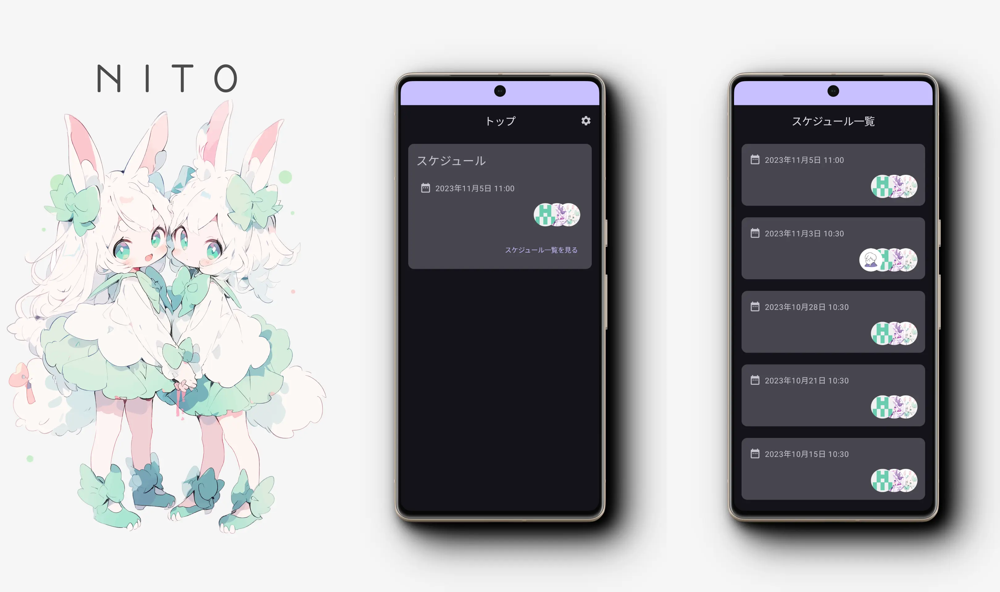

[](https://opensource.org/licenses/MIT)
[](https://app.renovatebot.com/dashboard)

[](https://codeclimate.com/github/2rabs/nito-app/maintainability)


<a href='https://apps.apple.com/jp/app/nito/id6472990576?itsct=apps_box_badge&amp;itscg=30200'></a>
<a href='https://play.google.com/store/apps/details?id=club.nito.app&pcampaignid=pcampaignidMKT-Other-global-all-co-prtnr-py-PartBadge-Mar2515-1'></a>

# NITO

NITO のユーザーアプリです。

## Features

NITO は実施予定の一覧と詳細を表示します。ユーザーはそのスケジュールを確認することができます。参加表明も可能です。

### Screenshots



## Development Environment

TBD

## Architecture

- [Kotlin Multiplatform](https://kotlinlang.org/lp/multiplatform/)
- [Jetpack Compose](https://developer.android.com/jetpack/compose?hl=ja)
- [SwiftUI](https://developer.apple.com/jp/xcode/swiftui/)

## Modularization

```text
.
│   アプリケーションのディレクトリ
├── app
│
│   ビルドロジックを集約したディレクトリ
├── build-logic
│
│   各機能モジュールで使用する共通のモジュールを集約したディレクトリ
├── core
│
│   各機能モジュールのディレクトリ
└── feature
```

## Build

TBD

## Testing

TBD

## Performance

TBD

## Contributors

Thanks to our wonderful contributors!

<a href="https://github.com/2rabs/nito-app/graphs/contributors">
  
</a>

## Repo Activity


## License

NITO is distributed under the terms of the MIT License. See the [license](LICENSE) for more information.
